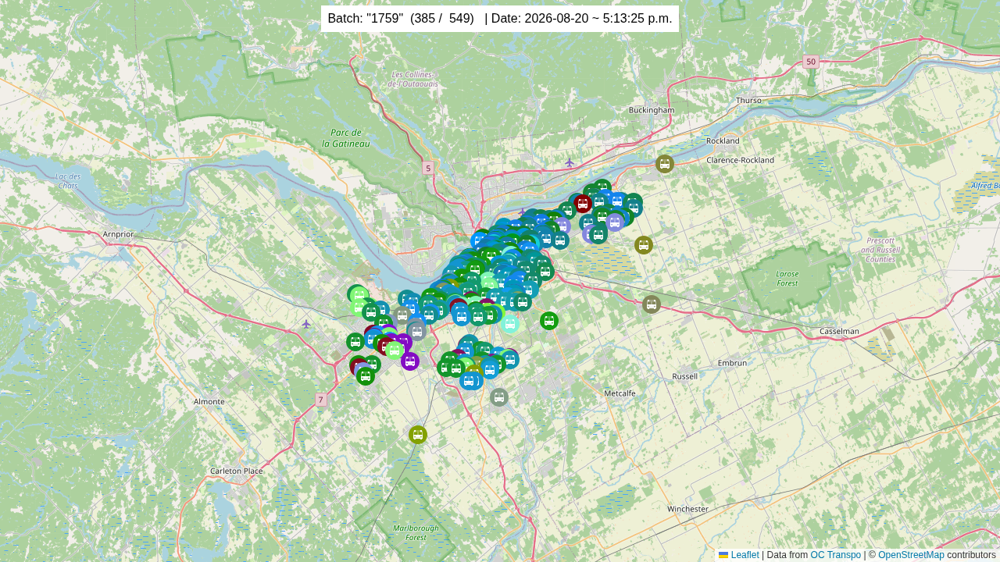
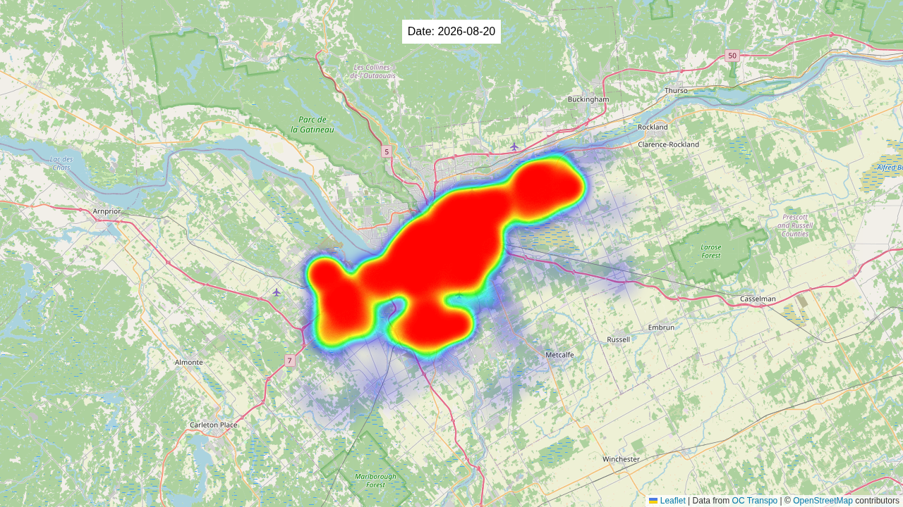

# Description

This project was created for me to experiment with [OC Transpo](https://www.octranspo.com/en/plan-your-trip/travel-tools/developers/)'s APIs/data.

The target was to visualize the locations of OC Transpo's vehicles during a day, and then generate a corresponding of the heatmap of the positions.

## Results

### Video from the interactive timeline

### The heatmap image

## More information

### Supabase's `edge-functions`
[README.md](edge-functions/README.md)

### Frontend
[README.md](frontend/README.md)

## Deprecated (`deprecated/*`)

Initially I created a `NodeJS` backend (`deprecated/backend`) + `SQlite` database (`deprecated/database`), but I replaced this by moving the code to be in Supabase's `edge-functions`

## AI Disclaimer

This project did not use any AI or related tools. See [NOAI.md](NOAI.md).
