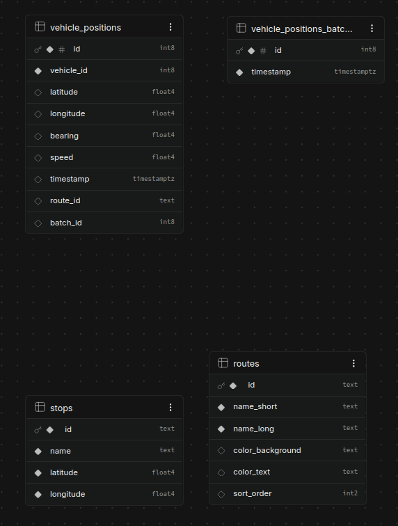

# Supabase - Edge functions

## Database

Note: The tables `routes` and `stops` are not used.

### Table `vehicle_positions_batches`

#### Columns

| Name | Type | Constraints |
|------|------|-------------|
| `id` | `int8` | Primary Identity |
| `timestamp` | `timestamptz` |  |

### Table `vehicle_positions`

#### Columns

| Name | Type | Constraints |
|------|------|-------------|
| `id` | `int8` | Primary Identity |
| `vehicle_id` | `int8` |  |
| `latitude` | `float4` |  Nullable |
| `longitude` | `float4` |  Nullable |
| `bearing` | `float4` |  Nullable |
| `speed` | `float4` |  Nullable |
| `timestamp` | `timestamptz` |  Nullable |
| `route_id` | `text` |  Nullable |
| `batch_id` | `int8` |  Nullable |

### Table `routes` (not in use)

#### Columns

| Name | Type | Constraints |
|------|------|-------------|
| `id` | `text` | Primary |
| `name_short` | `text` |  |
| `name_long` | `text` |  |
| `color_background` | `text` |  Nullable |
| `color_text` | `text` |  Nullable |
| `sort_order` | `int2` |  Nullable |

### Table `stops` (not in use)

#### Columns

| Name | Type | Constraints |
|------|------|-------------|
| `id` | `text` | Primary |
| `name` | `text` |  |
| `latitude` | `float4` |  |
| `longitude` | `float4` |  |

## Functions

### `get-vehicle-positions-and-store-json-file`

1. Using [OC Transpo](https://nextrip-public-api.developer.azure-api.net/) developer APIs
2. Gets the current `GTFS Real-time` data
3. Creates a new row on `vehicle_positions_batches` table
4. Adds the `RTVehiclePositions` array as rows to the `vehicle_positions_batches` table (using the `batch_id` we created above)

_This `edge-function` runs +/- once a minute using a `cron job`_

### `generate-yesterday-timeline`

1. Gets the array of `vehicle_positions_batches` for the target day (by default, the previous day when it's run)
2. Get all the `vehicle_positions_batches` for those `vehicle_positions_batches`
3. Saves all this data as a `JSON` file on `Supabase's Storage`

_This `edge-function` runs once a day at 02:00 AM using a `cron job`_